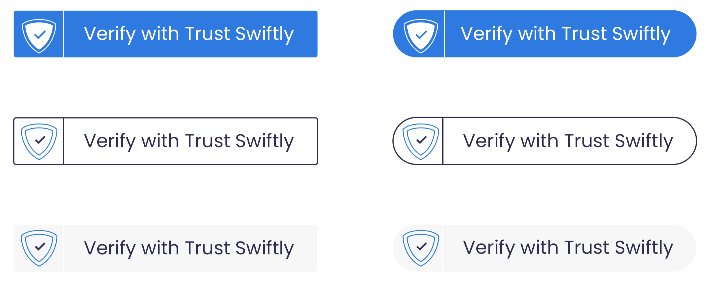

# Button Link

## Overview

The button link integration is a simple integration method that allows for the most compatibility of devices. The user will be redirected to your hosted verification page to complete the required steps. Upon completion we can redirect the user back to your in-flow steps and send notifications through webhooks or emails with the status.

## Steps

1. [Create a user](https://docs.trustswiftly.com/users#create-user) with our API with the information to verify.
2. Save the `magic_link` parameter to use for your button `href` value. 
3. _\(Optional\)_ [Regenerate the magic link](https://docs.trustswiftly.com/users#get-magic-link) for page refreshes or logins where the link is expired.
4. Display a button with the magic link. Recommended to use `target="_blank"` \([Example Bootstrap Button](https://www.tutorialrepublic.com/twitter-bootstrap-button-generator.php)\)
5. _\(Optional\)_ Setup redirect URL and messages. You can direct users back to your website upon verification completion to inform them of next onboarding steps.
   1. `https://{sub-domain}.trustswiftly.com`**`/settings`**

Example code

```markup
<a class="btn btn-primary" href="https://demo1.trustswiftly.com/security-verify?expires=1622216986&key=17fwnw4Nux6JbVS3RePdDK6n41s2RGQTFXPP2Nj1AZ3ZKnPDD60RQ&signature=ea4da5121e023df8a9c7dfbfa715a56dc1ee3e55e5ef0d7e4986f22a72fb7cc2" target="_blank" role="button">Verify me</a>
```


## Button Assets







