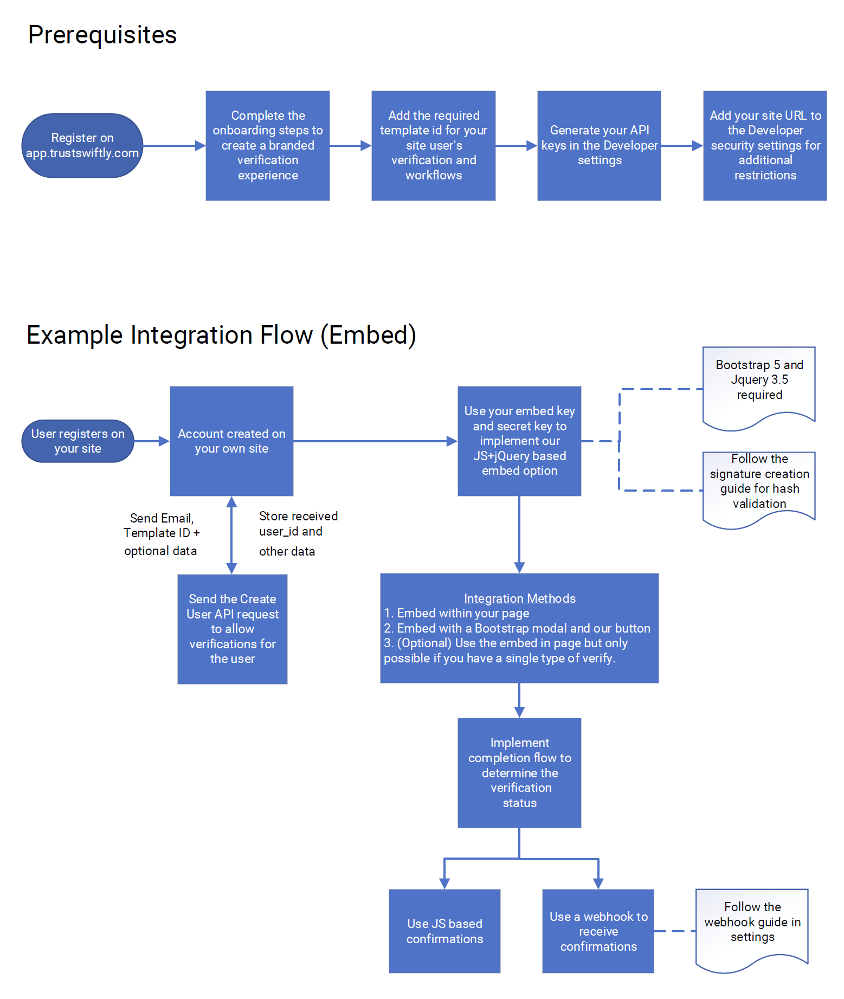

# HTML + Javascript

## General

This document explains how to integrate the verification flow directly into your web application through our JavaScript component to **verify** the identity of your users. This stage might be at the **signup** page of your application, or at a later point to enrich the profiles of your users. An example page of the HTML integration can be found at [https://{sub-domain}.trustswiftly.com/account/test.html](https://{sub-domain}.trustswiftly.com/account/test.html)

### Client Callbacks

| Parameter | Description |
| :--- | :--- |
| onDisplay | The onDisplay callback is called when the individual has clicked on the first "Start verifying" button and dialog is shown. |
| onStateChange | This callback is called when a user processes the verification and verification status is changed to either “pending” or “complete” or “failed” |
| onError | This callback is called when there’s an error encountered during a verify. |
| onComplete | This Callback is called when any verification is completed |
| onExit | This callback is called when user closes the embedded flow dialog. |

