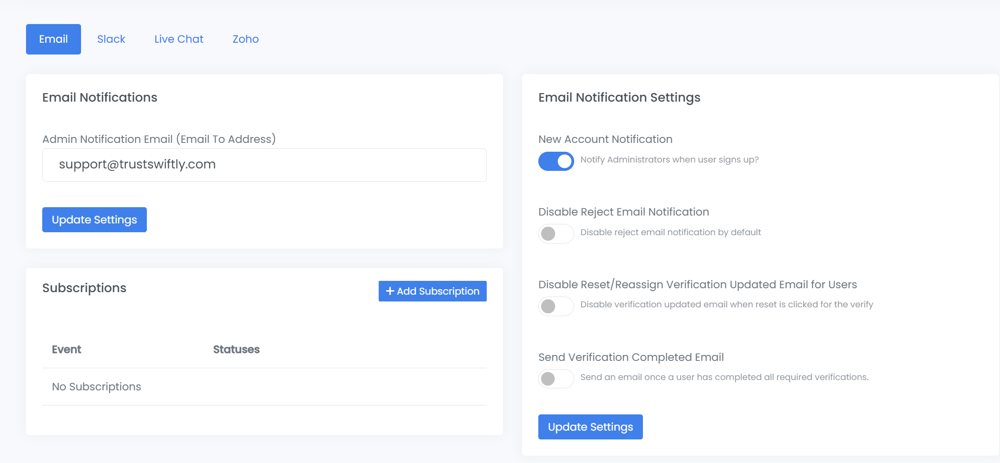

# Email and Chat

**Configuring Email and Live Chat Notifications**

Keep your team and users informed by setting up email notifications for key events. Additionally, you can provide real-time support to your users during the verification process by integrating a live chat widget directly onto the verification page.

**Email Notifications**

You can configure various email alerts to be sent to administrators when certain events occur.

**To configure email notifications:**

1. Navigate to **Settings** -> **Notifications**.
2. Select the **Email** tab.

**Email Notification Settings:**

* **Admin Notification Email:** Set the primary email address where all administrative alerts will be sent. This is the central point for receiving important updates.
* **Subscriptions:** For more granular control, you can subscribe to notifications for specific events. This allows you to be alerted only for the events that matter most to your workflow.
  * Click **+ Add Subscription**.
  * Select the **Event** you want to monitor (e.g., Phone / SMS).
  * Choose the specific **Event Status** (e.g., `verification.completed`).
  * Click **Add**. An email will now be sent to your admin address whenever a user successfully completes a phone verification.

**General Email Settings:**

On the right side of the page, you can manage global email settings:

* **New Account Notification:** Enable this to notify administrators whenever a new user signs up.
* **Disable Reject Email Notification:** By default, users receive an email if their verification is rejected. Enable this to turn that notification off.
* **Disable Reset/Reassign Verification Updated Email for Users:** Turn off the email that is sent to a user when their verification is reset or reassigned by an admin.
* **Send Verification Completed Email:** Enable this to send an email to a user once they have successfully completed all of their required verifications.

<figure><figcaption></figcaption></figure>

**Live Chat Integration**

Provide instant support to your users by embedding a live chat widget directly on the verification pages. This allows users to ask questions and get help if they encounter any issues.

**To enable Live Chat:**

1. Navigate to **Settings** -> **Notifications**.
2. Select the **Live Chat** tab.
3. **Enable** the "Enable or disable live chat" toggle.
4. From the **Chat** dropdown menu, select your live chat provider (e.g., Zendesk, Comm100, Zoho).
5. In the key field below (e.g., **Zendesk Key**), enter the unique integration key or ID provided by your chat service.
6. Click **Update Settings** to save the configuration.

Once enabled, the live chat widget will appear on the verification pages, giving your users a direct line to your support team.
