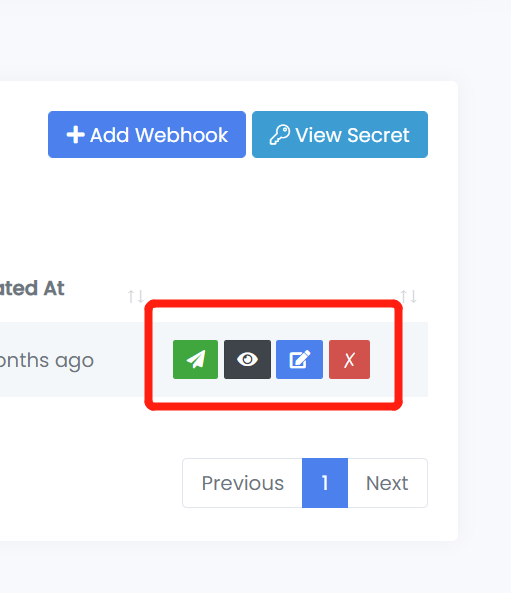

# Bubble App Integration

### Overview 

Trust Swiftly provides powerful identity verification tools to help fast-moving businesses ensure secure and seamless customer onboarding. This guide demonstrates how to integrate Trust Swiftly's verification services into a [Bubble.io](https://bubble.io/) app. The example app allows users to register, complete ID verification, and view their verification status—all within the Bubble platform. Following this guide will teach you how to create a user for verification, implement the verification process, and handle the verification status using Trust Swiftly's API and webhooks.


The below guide is an example of a basic Bubble integration. For more advanced scenarios it is advised to customize the flow according to your app and business case.&#x20;


### Prerequisites 

* A Bubble account with a basic understanding of creating and managing Bubble apps.
* API access to Trust Swiftly. Ensure you have your API key ready.
* Familiarity with webhooks and Bubble's API workflows.

### Steps to Implement 

#### Set Up API Key in Bubble 

Before making API calls to Trust Swiftly, you must configure your API key in Bubble.

* In your Bubble app, navigate to the "Plugins" tab and add the API Connector plugin if you haven't already.
* Open the API Connector plugin and create a new "Create User" API.
* Click the "Add another call" button.

<figure><figcaption></figcaption></figure>

#### Create a User for Verification 

To verify a user through Trust Swiftly, you'll first need to create the user via their API. This user will undergo the ID verification process.

1. Name the API Call:

○      In the API Connector plugin, name your API call, and in the "Use as" dropdown, select "Action."

2. Set the API Details:

○      Data Type: Set this to "JSON."

○      API Method: Choose POST.

○      API URL: Enter the Trust Swiftly API endpoint URL where the user will be created.

3. Add Headers:

○      In the "Headers" section, click "Add header" and include the following:

■      Authorization:

■      Key: _Authorization_

■      Value: _Bearer YOUR\_API\_KEY_ (replace YOUR\_API\_KEY with the actual API key provided by Trust Swiftly)

■      Content-Type:

■      Key: _Content-Type_

■      Value: _application/json_

4. Set the Request Body:

○      Body Type: Select "JSON."

○      JSON Body: Enter the JSON body structure, using <> brackets for dynamic values that will be filled in from your app’s data.

5. Initialize the API Call:

○      Uncheck the "Private" checkbox under the body parameters to ensure the fields are editable in workflows.

○      Click the "Initialize Call" button to test the API call. If successful, Bubble will display the API response. Save the call configuration once it's successfully initialized.

<figure><figcaption></figcaption></figure>

#### &#x20;**Use Dynamic Data:**

To send dynamic user data from your Bubble app during registration, you'll need to link your form inputs to the API parameters.

○      In your registration workflow, after the user clicks the "Register" button, add an action to trigger the API call.

○      After that add another action. Click on “plugins” and select the API call you just configured.

<figure><figcaption></figcaption></figure>

&#x20;

○      Once Clicked another panel will appear and there, add all the parameters you want in your JSON body and in the Value field add the form values.

<figure><figcaption></figcaption></figure>

&#x20;

Now, when you enter all the details in the form and hit the “Register button,” it will send a request to the API and create the user with the information provided.

**Handle API Response: Storing the Magic Link**

When the API request is successful, Trust Swiftly will return a response containing the magic link, which the user can use to verify their identity. This magic link should be stored in your Bubble database for further use.

**Steps to Handle the Response:**

1. In the workflow, after the API call action, add a new action to store the response data.
2. In Bubble, create a new field in your User data type called "Magic Link."

○      Data Type: Text

3. Set up an action to store the magic link in the "Magic Link" field of the user who just registered.

○      In the workflow, select the action "Make Changes to a Thing."

○      Thing to Change: Current User

○      Field to Change: Magic Link

○      Value: Result of Step X (API call) → Magic Link (replace "X" with the step number where the API call is made).

By storing the magic link in the Bubble database, you can later use it to redirect users to the verification page

#### Handle Verification Button and Email Magic Link 

After successfully creating the user, the next step is to enable the user to initiate the ID verification process. When the user clicks the "Verify" button, they should receive a magic link via email, which they will use to complete the verification.

1. Handle Email Sending:

○      When the user clicks the "Verify" button, you'll need to trigger an action that sends the magic link to the user’s email.

○      Note: Ensure that the magic link is correctly stored in your Bubble database (as set up in the previous section).

2. Set Up an Email Workflow:

○      Go to the “Workflows” section in Bubble and create a new workflow for when the "Verify ID" button is clicked.

○      Action: Send an email with the magic link.

■      Use Bubble’s email functionality (e.g., the “Send email” action) to send an email to the Current User.

■      In the email body, include the magic link retrieved from the database. You can format it as follows:

&#x20;       

3. **Verify Email Sending:**

○      Ensure that the email action is correctly configured and that the email is sent to the user's registered email address with the correct magic link.

By implementing these steps, users can receive their magic link via email and complete the ID verification process. Ensure you test the entire workflow to verify that emails are sent correctly and that the link directs users to the appropriate verification page.

&#x20;

#### Setting Up Email Notifications and Handling the Verification Process 

Before managing the verification process, you need to ensure that email notifications are enabled for your user in Trust Swiftly. Follow these steps to set up email notifications and handle the verification process:

**Set Up Email Notifications for Verification**

1. **Access Trust Swiftly Users Page:**

○      Log in to your Trust Swiftly account and navigate to the “Users” page.

2. **Find the User:**

○      Locate the user you want to verify by searching for their details (e.g., email or user ID).

3. **Click Verification Button:**

○      Select the user and click on the “Verification” button to access the verification settings.

<figure><figcaption></figcaption></figure>

4. Enable Email Notifications:

○      In the verification settings, ensure that email notifications are enabled.

○      This setting allows Trust Swiftly to send the necessary verification emails to the user, including the magic link and any follow-up emails if additional verification is needed.

<figure><figcaption></figcaption></figure>

&#x20;

**Receive and Access the Magic Link**

1. Initial Email with Magic Link:

○      The user receives an email with a magic link from Trust Swiftly.

○      Clicking this link directs the user to a verification page with a "Verify" button.

**Click the Magic Link and Verify Identity**

1. Verification Page:

○      On the verification page, the user clicks the "Verify" button to start the verification process.

<figure><figcaption></figcaption></figure>

2. Initial Verification Attempt:

○      Trust Swiftly processes the verification request. If additional verification is required, the user will receive a follow-up email.

**Follow-Up Email**

1. Receive Follow-Up Email:

○      If further verification is necessary, Trust Swiftly sends a follow-up email.

○      Example Content:

■      “Due to an additional review we require another method of verification. Please complete the new request to verify yourself.”

■      Verify Identity Button: Includes a button or URL for completing the additional verification.

<figure><figcaption></figcaption></figure>

○      Click on Confirm Email button and it will redirect you another page

○      Enter your email in the field and click the “Send verification Email” button

<figure><figcaption></figcaption></figure>

#### Set Up Webhook for Verification Status 

To keep track of the verification status, you need to set up a webhook with Trust Swiftly and configure Bubble to handle the incoming webhook data. This will allow you to update the user’s verification status based on Trust Swiftly's notifications.

1\. Create a Webhook in Trust Swiftly

1. Log in to your Trust Swiftly account and navigate to the Webhooks section in the dashboard under “Developers” tab.
2. Create a New Webhook:

○      Click on “Create Webhook” to start the setup process.

<figure><figcaption></figcaption></figure>

○      Webhook URL: Enter the URL where Trust Swiftly will send the webhook notifications. This should be the endpoint of your Bubble app that will handle incoming webhooks. (See section “Configure Backend Workflow Bubble” below)

○      Verifications: Select “Email”

○      Webhook Events: Verification.completed

○      Save: Complete the setup by saving the webhook configuration.

<figure><figcaption></figcaption></figure>

2\. Configure Backend Workflow in Bubble

1. Set Up the Webhook Endpoint:

○      In your Bubble app, go to the "API Workflows" section.

○      Create a new API workflow. This will serve as the endpoint for handling webhook requests.

○      Endpoint Name: Choose a meaningful name (e.g., _handle\_verification\_webhook_).

○      Endpoint URL: Bubble will generate a URL for this workflow. Copy this URL and use it as the Webhook URL in Trust Swiftly.

2. Define the API Workflow:

○      Add Actions to handle the incoming data from Trust Swiftly.

○      Verifyuser api workflow settings:

■      Change “Trigger workflow with” method to POST

■      Click on Detect Data to get the URL of the API that’ll be later on used in the webhook.

<figure><figcaption></figcaption></figure>

○      Parse the Webhook Data: Use Bubble’s built-in actions to extract relevant information from the webhook payload (verification status).

○      Update the User Record:

■      Use the "Make Changes to a Thing" action to update the user’s record in your Bubble database based on the information received.

■      For example, if the webhook indicates that the verification status is complete, update the corresponding field in the user’s profile.

&#x20;

By following these steps, you’ll be able to set up and handle webhooks from Trust Swiftly, ensuring your Bubble app stays in sync with the latest verification status updates.

#### Redirect Users to Success Page Upon Verification 

Once the user completes the verification process, you need to ensure they are redirected to a success page to confirm their verification status.

1\. Handle Verification Completion in Bubble

1. **Update API Workflow:**

○      In the API workflow that handles the Trust Swiftly webhook (as described in the previous section), include an additional action to redirect the user.

○     **After Updating User Record:**

■      Add an action to send a response or trigger a redirect based on the verification status.

2. **Set Up Redirection Logic:**

○      Trigger Redirection:

■      Use Bubble’s “Go to page” action to redirect the user to the success page that is triggered when the user's verification field is changed.

■      Set up the URL of the success page (e.g., /success) in the workflow action.

**Example Workflow Configuration:**

●      Endpoint Name: _verification\_success\_redirect_

●      Actions:

○      Update User Record: Ensure the user’s verification status is updated.

○      Redirect User: Use “Go to page” action to direct the user to the success page.

Example Success Page

<figure><figcaption></figcaption></figure>

By setting up the redirection to a success page, you provide users with an explicit confirmation of their verification status, enhancing the overall user experience.

&#x20;

&#x20;

&#x20;

&#x20;

&#x20;

&#x20;
