# Webflow ID Verification

### Overview 

Trust Swiftly provides powerful identity verification tools designed to help fast-moving businesses ensure secure and seamless customer onboarding. This guide demonstrates how to integrate Trust Swiftly's verification services into a [Webflow ](https://webflow.com/)app. We make it simple to verify identities through multiple ways such as ID documents, SMS, liveness checks and more to secure your application. The example app allows users to register, complete ID verification, and view their verification status—all within the Webflow platform. By following this guide, you'll learn how to create a user for verification, implement the verification process, and handle the verification status using Trust Swiftly’s API and webhooks.


The following guide is for testing purposes and not intended to be used for a production or advanced setup app. We recommend you configure the settings according to your business and select unique verifications. For more help contact us for tips on creating a verification process.


### Prerequisites 

* [A Webflow account](https://webflow.com/signup) with a basic understanding of how to create and manage Webflow apps.
* API access to Trust Swiftly. Ensure you have your [API key ](../getting-an-api-key.md)ready.
* Familiarity with webhooks and Webflow's API workflows.

### Steps to Implement 

#### Set Up API Key in Webflow 

Before you start making API calls to Trust Swiftly, you need to configure your API key in Webflow.

* In your Webflow app, navigate to the "Logics" tab and click on the “New Flow” button to begin setting up a new flow.
* Click on “Select a trigger to start this flow” and choose “Form submissions” as the trigger.

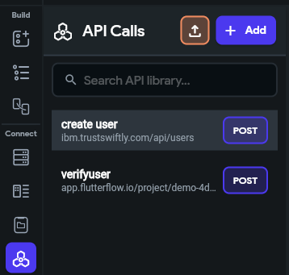

* Assign a name to your flow, such as "Create user”.
* Click on the “+” icon, placed just below the trigger.
* Select “Make HTTP request” option from the list of available actions.

#### Create a User for Verification

After selecting "Make HTTP request," you will be prompted to configure the details of the request. Here’s what you need to do:

1. **Name the API Call**:
   * Assign a name to your API, such as "Create User API".
2. **Set the API Details**:
   * **API Method**: Choose POST.
   * **API URL**: Enter the Trust Swiftly API endpoint URL where the user will be created.
3. **Add Headers**:
   * In the "Headers" section, click "+" icon and include the following:
     * **Authorization**:
       * **Name**: Authorization
       * **Value**: Bearer YOUR\_API\_KEY (replace YOUR\_API\_KEY with the actual API key provided by Trust Swiftly)
     * **Content-Type**:
       * **Name**: Content-Type
       * **Value**: application/json
4. **Set the Request Body**:
   * **Body**: Enter the JSON body structure. To add dynamic value just click on the **Insert variable icon.**
   * Select the flow trigger and then select the corresponding variables.

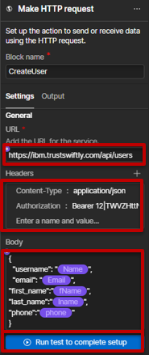 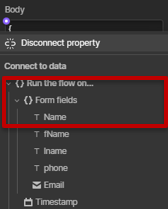

1. **Test the API Call**:
   * Click on the “Run test to complete the setup” button. This initiates a test of the configured HTTP request to ensure that it functions correctly with the dynamic values and setup.
   * Enter the relevant sample data and click on the “Run test” button to execute the test with the provided sample data.
   * Review the response to ensure that the API call was successful, and that the data was correctly processed.
   * Click on “Add data” to finalize the setup.

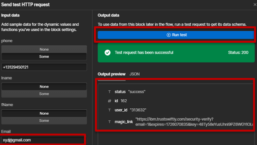

**Handle API Response: Storing the Magic Link**

When the API request is successful, Trust Swiftly will return a response containing the magic link, which the user can use to verify their identity. This magic link should be stored in your Webflow database for further use.

* If you are storing the data in a CMS collection, add an action to “Create Collection Item”.
* Specify the CMS collection where you want to store the data, such as “Users”.
* Map the fields from the API response and form submission to the corresponding CMS fields. For example, store the magic link and user details.

**Note:** Webflow does not allow usrs to store link dynamically, store the magic link in dummy field whose field type is “Plain Text”.

* For magic link, drop-down “Response Body” and select “magic\_link”.

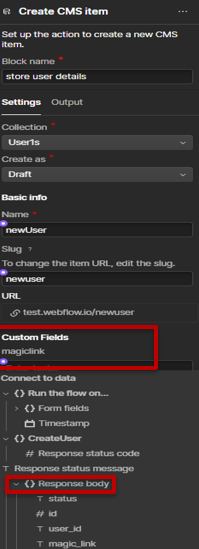

1. **Store Magic link in CMS as Link:**
   * In order to store magic link as a link type you will need to use Make
   * Note that Webflow does not support storing links dynamically. Therefore, use a third-party application, such as Make (formerly Integromat), to handle the storing link process.
2. **Set Up an Updating Item Scenario in Make**:
   * **Get CMS Item**
     * **Create a New Scenario in Make and** click on the “+” icon to add a new module.
     * Search for “Webflow” and select the Webflow app from the list.
     * Select the trigger action “Get an item” trigger to get item from CMS.

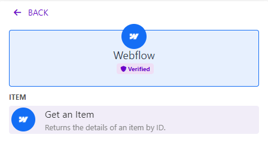

* Configure this module to fetch the relevant item from your CMS. You can map your item using “By selecting” option in **Enter item ID** field.

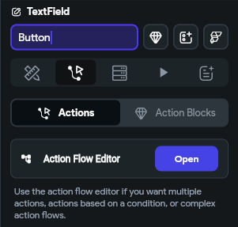

**Update CMS Item**

* Add another module and select "Update an Item" from the dropdown.
* Configure the update settings, and use the data fetched from the "Get Item from CMS" module to set the magic link.
* Map the magic link to dummy link field in which the original link is stored as plain text.
* Press “ok” to save your module.

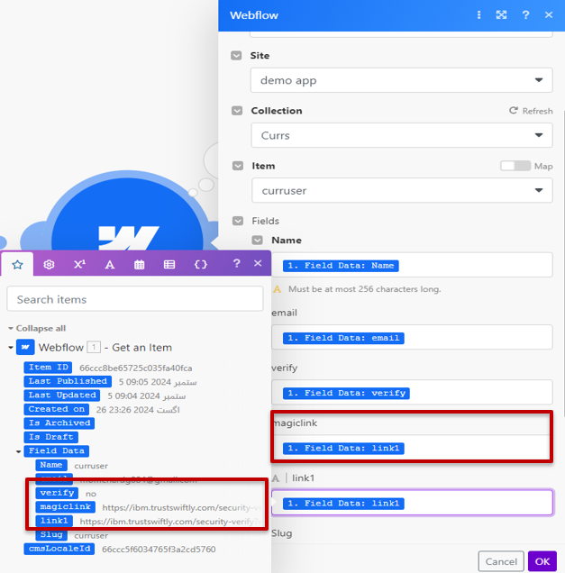

1. **Verify Update Item Scenerio**:
   * Click on “Run once” to Update the Item.
   * Now you will be able to redirect to verify page using this link.

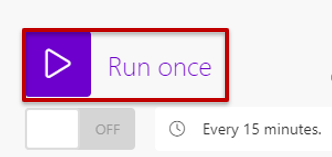

#### Handle Verification Button and Email Magic Link 

After successfully creating the user, the next step is to enable the user to initiate the ID verification process. When the user clicks the "Verify" button, they should receive a magic link via email, which they will use to complete the verification.

1. **Create Verification Page:**
   * Navigate to “Pages” tab.
   * In the "CMS Collection Pages" section, choose the appropriate collection template that corresponds to where you are storing user details.
   * Add a Form block named “Verify”.
   * Click the submit button and go to button settings.
   * Get the magic\_link URL from your CMS collection.
   * This will redirect the user to the magic link when verify button is pressed

#### Setting Up Email Notifications and Handling the Verification Process 

Follow these steps to set up email notifications and handle the verification process:

**Set Up Email Notifications for Verification**

1. **Access Trust Swiftly Users Page:**
   * Log in to your Trust Swiftly account and navigate to the “Users” page.
2. **Find the User:**
   * Locate the user you want to verify by searching for their details (e.g., email or user ID).
3. **Click Verification Button:**
   * Select the user and click on the “Verification” button to access the verification settings.

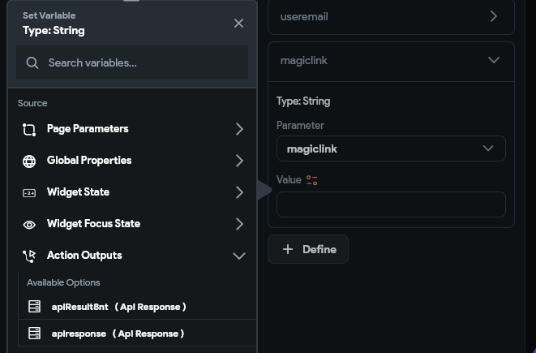

1. **Enable Email Notifications:**
   * In the verification settings, ensure that email notifications are enabled.
   * This setting allows Trust Swiftly to send the necessary verification emails to the user, including the magic link and any follow-up emails if additional verification is needed.

**Receive and Access the Magic Link**

1. **Initial Email with Magic Link:**
   * The user receives an email with a magic link from Trust Swiftly.
   * Clicking this link directs the user to a verification page with a "Verify" button.

**Click the Magic Link and Verify Identity**

1. **Verification Page:**
   * On the verification page, the user clicks the "Verify" button to start the verification process.

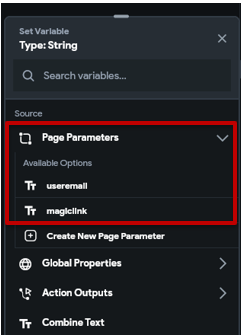

1. **Initial Verification Attempt:**
   * Trust Swiftly processes the verification request. If additional verification is required, the user will receive a follow-up email.

**Follow-Up Email**

1. **Receive Follow-Up Email:**
   * If further verification is necessary, Trust Swiftly sends a follow-up email.
   * Example Content:
     * “Due to an additional review we require another method of verification. Please complete the new request to verify yourself.”
     * Verify Identity Button: Includes a button or URL for completing the additional verification.

*
  * Click on Confirm Email button and it will redirect you to another page
  * Enter your email in the field and click the “Send verification Email” button

#### Set Up Webhook for Verification Status 

To keep track of the verification status, you need to set up a webhook with Trust Swiftly and configure Webflow to handle the incoming webhook data. This will allow you to update the user’s verification status based on Trust Swiftly's notifications.

**1. Create a Webhook in Trust Swiftly**

1. **Log in** to your Trust Swiftly account and navigate to the Webhooks section in the dashboard under “Developers” tab.
2. **Create a New Webhook**:
   * Click on “Create Webhook” to start the setup process.

*
  * **Webhook URL**: Enter the URL where Trust Swiftly will send the webhook notifications. This should be the endpoint of your Webflow app that will handle incoming webhooks. (See section “Setup Webhook in Webflow” below)
  * **Verifications:** Select “Email”
  * **Webhook Events**: Verification.completed
  * **Save**: Complete the setup by saving the webhook configuration.

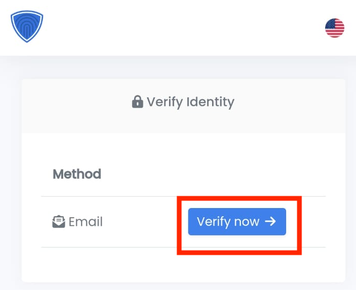

**2. Configure Verify flow in Webflow**

1. **Set Up the Webhook Endpoint**:
   * In your Webflow app, go to the "Logic" section.
   * Create a new flow and set “Incoming webhook” as trigger. This will serve as the endpoint for handling webhook requests.
   * **Trigger Name**: Choose a meaningful name (e.g. Verify).
   * **Endpoint URL**: Webflow will generate a URL for this workflow. Copy this URL and use it as the Webhook URL in Trust Swiftly.

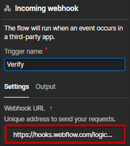

1. **Update CMS Item**:
   * Create a new field for “User” collection named “isVerified” and set default value to “no”.
   * **Update the User Record**:
     * Use the "Update CMS item" action to update the user’s record in your Webflow database based on the information received.
     * For example, if the webhook indicates that the verification status is complete, update the isVerified field to yes in the user’s profile.

By following these steps, you’ll be able to set up and handle webhooks from Trust Swiftly, ensuring your Webflow app stays in sync with the latest verification status updates.

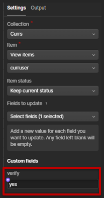

#### Redirect Users to Success Page Upon Verification

Once the user completes the verification process, you need to ensure they are redirected to a success page to confirm their verification status.

**1. Handle Verification Completion in Webflow**

* Navigate to your CMS template page in which your verify form is loacted.
* Configure form settings and change the form’s conditional visibility to “verify equals no”

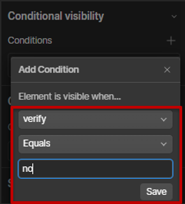

* Add a text box with “Verification Completed Successfully” text
* Configure text settings and change the text’s conditional visibility to “verify equals yes”

**Example Success Page**

By setting up the redirection to a success page, you provide users with a clear confirmation of their verification status, enhancing the overall user experience.
