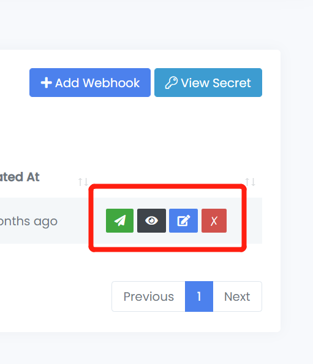

# Setup and Handling Webhooks

Our webhooks allow you to receive real-time notifications about verification events, enabling you to automate your workflows. This guide provides the necessary information to securely and reliably set up, handle, and troubleshoot these webhooks.

### Step 1: Configure Your Endpoint in Trust Swiftly

1. Navigate to the Webhooks section in your settings page: `https://{your-subdomain}.trustswiftly.com/admin/settings/webhooks`
2. Click the **Add Webhook** button.
3. Enter your publicly accessible endpoint URL and select the events you want to subscribe to. If you need a temporary URL for testing, services like [webhook.site](https://webhook.site/) are excellent for inspecting payloads.

### Step 2: Secure Your Endpoint with Signature Verification

For each event, Trust Swiftly sends a `Signature` header in the HTTP POST request. You **must** verify this signature to confirm that the request originated from us and was not altered during transmission.

The signature is an HMAC-SHA256 hash, generated using your unique **Webhook Signing Secret** and the **raw, unmodified request body**.

Your server-side code must perform the same calculation and compare the result with the signature we sent. Use a secure, constant-time comparison function to prevent timing attacks.

```php
// Pseudocode for verification
$secret = 'your_webhook_signing_secret';
$receivedSignature = $_SERVER['HTTP_SIGNATURE'];
$rawPayload = file_get_contents('php://input');

$computedSignature = hash_hmac('sha256', $rawPayload, $secret);

// Use a secure comparison function
if (!hash_equals($computedSignature, $receivedSignature)) {
  // The request is invalid - reject it
  http_response_code(403);
  exit('Invalid signature.');
}

// The signature is valid - proceed to process the payload
```

For full, production-ready code, see our detailed **Webhook Code Examples**.

### Step 3: Understand the Webhook Payload

After verifying the signature, you can safely parse the JSON payload. Our webhooks follow a standardized structure.

#### Key Identifiers

* `relationships.user_uuid`: The internal Trust Swiftly UUID for the user.
* `relationships.user_id`: The internal Trust Swiftly ID for the user.
* `data.reference_id`: **(Most Important)** This is _your_ internal identifier for the user. When you initiate a verification, you can pass your system's `user_id` in this field. We return it in the webhook so you can easily map the event back to the correct user in your database.

#### Event Types

Your handler should be built to recognize the `type` field in the payload. Common event types include:

| Event Type                | Description                                                                         |
| ------------------------- | ----------------------------------------------------------------------------------- |
| `verification.pending`    | Fired when a verification process has been initiated but is not yet complete.       |
| `verification.in-process` | Fired when a multi-step verification is partially complete.                         |
| `verification.completed`  | Fired when a verification has been successfully approved.                           |
| `verification.rejected`   | Fired when a verification has been reviewed and rejected.                           |
| `user.status.changed`     | Fired when a user status has been changed from Active, Verified, Review, or Banned. |

### Step 4: Best Practices for Reliable Handling

A production-grade webhook handler must be fast and resilient.

#### Acknowledge First, Process Later (Asynchronous Processing)

To acknowledge receipt of an event, your endpoint must return a `2xx` HTTP status code quickly. If we don't receive a `2xx` response in a timely manner, we will assume the delivery failed and will retry.

To avoid timeouts, your endpoint should do the absolute minimum amount of work before responding. The best practice is to hand off complex business logic to a background job or queue.

1. Receive the request.
2. Verify the signature.
3. Add the payload to a queue (like RabbitMQ, SQS, or a database queue).
4. Immediately return a `200 OK` response.
5. A separate background worker can then pull jobs from the queue and process them without risk of a timeout.

#### Handle Retries with Idempotency

Because network issues can occur, your system may receive the same webhook event more than once. Your endpoint must be **idempotent**, meaning it can safely process the same event multiple times without causing duplicate data or errors.

The easiest way to achieve this is to track the unique `id` of every webhook payload.

```
// Pseudocode for an idempotent check
function handleWebhook(event) {
  if (hasEventBeenProcessed(event.id)) {
    // Already handled, so just acknowledge success
    return 200; 
  }

  // Add to queue for processing
  addEventToQueue(event);
  logEventAsProcessed(event.id);

  return 200;
}
```

### Step 5: Development and Troubleshooting

#### Testing Locally

Webhooks require a public URL, which can be a challenge during local development. We recommend using a tool like [**ngrok**](https://ngrok.com/) to create a secure tunnel to your local server.

1. Run your application locally (e.g., on `localhost:3000`).
2. Run ngrok: `ngrok http 3000`.
3. Ngrok will provide a public URL (e.g., `https://random-string.ngrok.io`).
4. Use this URL as your webhook endpoint in the Trust Swiftly dashboard. Requests will be forwarded to your local application.

#### Troubleshooting Signature Mismatches

A signature mismatch is the most common issue. If you encounter this, check the following:

1. **Are you using the raw request body?** This is critical. Do not parse and re-stringify the JSON before verification, as this will alter the content and cause the signature to fail.
2. **Is your Webhook Signing Secret correct?** Double-check that you are using the correct secret from the dashboard and that it has no leading/trailing whitespace.
3. **Are you checking the correct header?** The header name is `Signature`. Be aware that some frameworks may transform this to `HTTP_SIGNATURE` or `Http-Signature`.

### Manage and Test Your Webhooks

Once configured, you can test, view logs, edit, or delete a webhook using the action buttons in the dashboard. Sending a test webhook is an excellent way to debug your endpoint and ensure your signature verification logic is working correctly.

<figure><figcaption></figcaption></figure>
